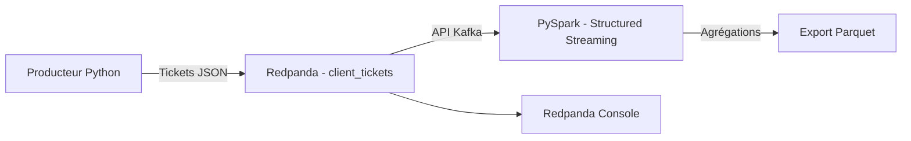

# Modélisez une infrastructure dans le cloud

Projet OpenClassrooms consacré à la conception d'une infrastructure cloud hybride et à la réalisation d'un pipeline de traitement de tickets clients en temps réel.

## Contexte

InduTechData souhaite moderniser son système d'information tout en conservant une compatibilité avec son infrastructure on-premise. Ce dépôt contient :

- la modélisation d'une architecture hybride on-premise / AWS ;
- un POC de gestion de tickets clients avec Redpanda et PySpark ;
- une conteneurisation complète avec Docker Compose ;
- un export des résultats agrégés au format Parquet.

## Architecture du pipeline



Le producteur génère des tickets aléatoires au format JSON. Redpanda les conserve dans le topic `client_tickets`. PySpark lit ce flux, transforme les messages en colonnes, filtre les données invalides, puis calcule des agrégations par type de demande et priorité. Le résultat est exporté au format Parquet.

La modélisation détaillée de l'infrastructure hybride est disponible dans [`architecture/architecture-hybride.md`](architecture/architecture-hybride.md).

## Structure du projet

```text
.
├── architecture/
│   └── architecture-hybride.md
├── data/
│   └── output/                    # Résultats générés, ignorés par Git
├── producer/
│   ├── Dockerfile
│   ├── producer.py
│   └── requirements.txt
├── pyspark/
│   ├── Dockerfile
│   └── consumer.py
├── .gitignore
├── docker-compose.yml
└── README.md
```

## Contenu d'un ticket

Chaque ticket contient au minimum les champs demandés dans l'énoncé :

| Champ | Description | Exemple |
|---|---|---|
| `ticket_id` | Identifiant unique du ticket | `TICKET-BB04AAAC` |
| `client_id` | Identifiant du client | `CLIENT-4826` |
| `created_at` | Date et heure UTC de création | `2026-09-09T09:14:07+00:00` |
| `request` | Texte de la demande | `Impossible de me connecter` |
| `request_type` | Catégorie de la demande | `technical` |
| `priority` | Niveau de priorité | `high` |

## Prérequis

- Docker Desktop ;
- Docker Compose v2 ;
- suffisamment de mémoire disponible pour exécuter Redpanda et PySpark ;
- un terminal exécuté à la racine du dépôt.

Python n'a pas besoin d'être installé localement pour lancer le POC : le producteur et PySpark s'exécutent dans des conteneurs.

## Lancement complet

Construire les images et démarrer le pipeline :

```bash
docker compose up --build -d
```

Vérifier l'état des conteneurs :

```bash
docker compose ps -a
```

États attendus :

- `redpanda` : `healthy` ;
- `console` : `Up` ;
- `pyspark` : `Up` ;
- `topic-init` : `Exited (0)` après la création du topic ;
- `producer` : `Exited (0)` après l'envoi des 20 tickets.

## Vérifications

### Vérifier le topic Redpanda

```bash
docker compose exec redpanda rpk topic list -X brokers=redpanda:9092
```

Le topic `client_tickets` doit apparaître.

### Examiner les tickets produits

```bash
docker compose logs --tail=50 producer
```

Le message `Tous les tickets ont été livrés.` confirme la fin de la production.

Pour envoyer 20 nouveaux tickets :

```bash
docker compose run --rm producer
```

### Examiner les agrégations PySpark

```bash
docker compose logs --tail=150 pyspark
```

PySpark produit un tableau contenant :

| Colonne | Signification |
|---|---|
| `request_type` | Type de demande |
| `priority` | Niveau de priorité |
| `ticket_count` | Nombre de tickets du groupe |
| `last_ticket_at` | Date du ticket le plus récent du groupe |

## Export Parquet

Les agrégations sont exportées dans :

```text
data/output/ticket-aggregates/
```

Vérifier les fichiers générés :

```bash
ls -lh data/output/ticket-aggregates
```

Résultat attendu :

```text
_SUCCESS
part-00000-....snappy.parquet
```

`_SUCCESS` est un marqueur de réussite créé par Spark. Le fichier `part-*.snappy.parquet` contient les agrégations compressées.

## Interface Redpanda Console

Lorsque les conteneurs sont actifs, l'interface est accessible à l'adresse :

```text
http://localhost:8080
```

Elle permet de consulter le topic, ses partitions et ses messages.

## Arrêt et réinitialisation

Arrêter les conteneurs en conservant les données Redpanda :

```bash
docker compose down
```

Réinitialiser complètement le POC, y compris le volume Redpanda :

```bash
docker compose down -v
```

La seconde commande supprime les messages déjà stockés dans Redpanda.

## Choix techniques

- **Redpanda** assure le transport et la conservation temporaire des événements en temps réel avec une interface compatible Kafka.
- **PySpark Structured Streaming** lit continuellement les messages et réalise les transformations et agrégations.
- **Parquet** fournit un format en colonnes, compressé et adapté aux traitements analytiques.
- **Docker Compose** construit, connecte et lance automatiquement tous les composants du pipeline.

## Sécurité et limites du POC

Ce projet est une démonstration locale et non une configuration de production :

- un seul broker Redpanda est utilisé ;
- le topic possède une seule partition et un facteur de réplication de 1 ;
- les communications internes ne sont pas authentifiées ni chiffrées ;
- le producteur génère seulement 20 tickets par exécution ;
- le conteneur PySpark utilise l'utilisateur `root` afin d'écrire dans le dossier local monté par Docker.

Dans une architecture de production, il faudrait notamment activer TLS, l'authentification et les autorisations, utiliser plusieurs brokers et partitions, gérer les secrets, superviser les services et exécuter les conteneurs avec des droits minimaux.

## État des critères de l'exercice 2

- [x] Redpanda installé et opérationnel
- [x] Topic `client_tickets` créé
- [x] Producteur Python fonctionnel
- [x] Champs obligatoires présents dans les tickets
- [x] PySpark et connecteur Kafka installés
- [x] Lecture et traitement du flux Redpanda
- [x] Transformations et agrégations
- [x] Export au format Parquet
- [x] Dockerfile pour le producteur et PySpark
- [x] Orchestration et automatisation avec Docker Compose
- [x] Diagramme Mermaid intégré au README
- [ ] Présentation vidéo du POC
