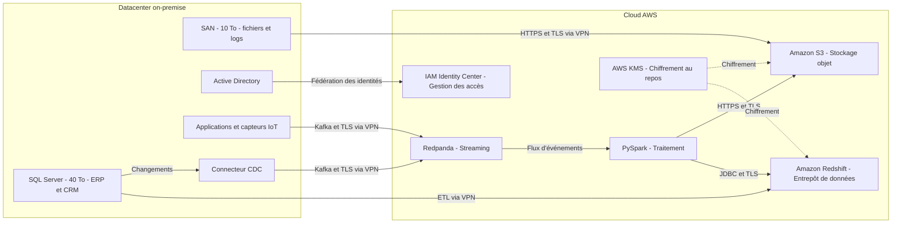

## Architecture hybride InduTechData

### Rôle des composants

| Composant | Fonction principale |
|---|---|
| SQL Server | Héberge les données critiques des applications ERP et CRM. |
| SAN | Stocke les fichiers, journaux système et données non structurées existantes. |
| Connecteur CDC | Détecte les changements dans SQL Server et les publie sous forme d'événements. |
| Redpanda | Transporte les événements en temps réel entre producteurs et consommateurs. |
| PySpark | Transforme, filtre et agrège les données. |
| Amazon S3 | Conserve durablement les données brutes ou transformées. |
| Amazon Redshift | Analyse de grandes quantités de données avec SQL. |
| IAM Identity Center | Centralise les accès AWS en lien avec Active Directory. |
| AWS KMS | Gère les clés utilisées pour chiffrer les données stockées. |

### Sécurité et protocoles

- Les communications entre le datacenter et AWS passent par un VPN sécurisé.
- TLS chiffre les données pendant leur transfert.
- AWS KMS protège les données stockées dans Amazon S3 et Amazon Redshift.
- IAM Identity Center permet une gestion homogène des identités avec Active Directory.
- Le protocole Kafka est utilisé pour les flux Redpanda.
- HTTPS est utilisé pour les transferts vers Amazon S3.
- JDBC est utilisé pour les échanges avec Amazon Redshift.

